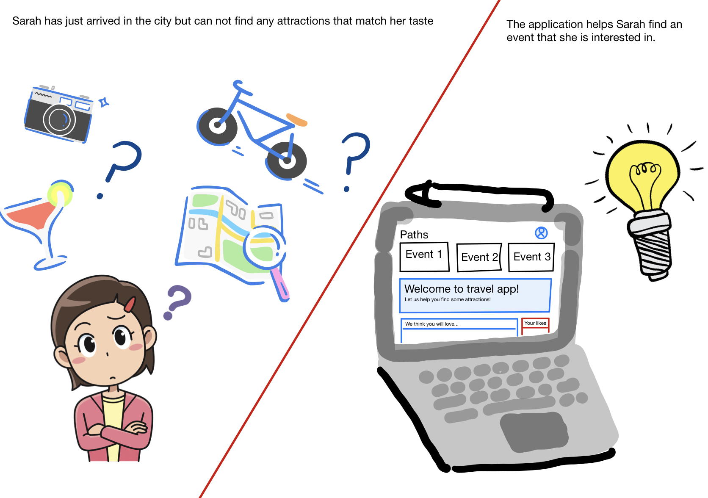

**School of Computing — Year 4 Project Proposal Form**

Project title: MyTrip

Student 1 Name: James Fallon

Student 1 ID: 18394123

Student 2 Name: Alex O Neill

Student 2 ID: 18414882

Project Supervisor: Gareth Jones

**Introduction**

Our project is a traveling organization web-app to recommend people interesting things to do based on their interests when they go traveling. The user will be able to see popular events/ attractions that match their profile. These will be matched using machine learning - specifically user interest and behavior modeling. The events/attractions can be rated by other users. Semantic analysis will be used to judge if a review is positive or negative based on the language used in the text.

**Outline**

* A system that is focused on bringing users together with their favourite events and attractions when on a trip.
* Using multiple forms of machine learning to recommend the user with appropriate information regarding things to do on their trip.
* User behaviour analysis will be the main type of machine learning used.
* Based on the user's interests and likes, the system will be able to build a portfolio of recommended attractions and events. The system will take into consideration the time and budget of the user to ensure the recommendations are realistic.
* The profile of the user will be built on the user's interests. These interests can be user determined (specified likes by user) and likes that the machine learning algorithm determines to be appropriate. Since many people travel only once or twice a year, the learning will also take into consideration what people with similar, more frequently used and experienced profiles enjoy.
* Events and attractions will have the ability to be reviewed by users. Semantic analysis will be performed on these reviews to analyse the context of the review. Each entry by a user will get a positive or negative score, ultimately determining how good the event is and how suited it is to a person with a similar profile.
* The system will be a web application with the goal of working on a wide range of devices.

**Background**

* A problem we identified when we were looking for things to do when travelling, was that we were recommended the typical tourist attractions.
* We struggled to find any attractions that fit our interests, as travel websites and search queries return the most popular, mostly family attractions.
* From our own experience, we wanted to create a tool to connect users with things to do that actually match their interests.

**Achievements**

* With the help of machine learning, the web app will allow users to plan holidays with events & attractions that is suited to them
* The target audience is anyone going on holidays/traveling and are looking for events or attractions to go to

**Justification**

* This web-app will make it easier for people to plan trips away
* It can be used anywhere and at any time that is appropriate for the user as long as they have an internet connection and a device that can display the web app
* It will be useful for people who want to plan trips but don’t want to go to the usual tourist attractions

**Programming language(s)**

* Python (Django)
* JavaScript
* MySQL

**Programming tools / Tech stack**

* MySQL
* Gitlab
* VSCode
* Notion
* "Django provides a simple WSGI server as a dev server"

**Hardware**

* Hardware is any device that can display a web page

**Learning Challenges**

* The first learning challenge will be effectively planning the project. This was our biggest downfall with our third year project. We are hoping that a strong plan will keep our project focused.
* Using the appropriate software development practices and principles to ensure our code is of a high standard and well structured.
* Working with large data sets.
* Learning to train a machine learning model with unstructured data on a large scale.
* Using the Django framework for the first time.
* We are used to using MySQL but we want to find the most efficient way to manage our data, since MySQL is not efficient working with machine learning.

**Breakdown of work**

When it comes to the breakdown of work we plan to take individual responsibility for certain features in the development of the application. When planning a large project, it is standard practice to have one person in charge of each feature or area of the project, but multiple members of a team working to carry out the activity.

Although a person will be responsible for the management of the features, we plan to work together to develop these features through paired programming. Through projects over the years, we have come to realise that working together in pairs to develop the application leads to a higher standard of code and an agile approach to planning.

Alex O Neill 
* JavaScript
* UI Design
* Semantic Analysis

James Fallon
* Database Management
* User Behaviour Analysis
* Django

**Example**

An example of the project in action: A user is going traveling but doesn't know what events/attractions to attend. They log into the app, select the destination of their trip and this will display the events/attractions they would be most interested in going to based on the interests in their profile.

